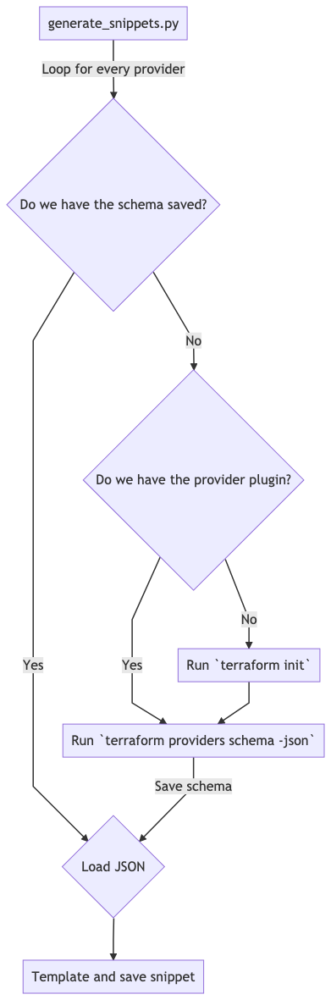

# terraform-generate-snippets

The source of
[yasnippet-terraform](https://github.com/staticaland/yasnippet-terraform).

Generate editor snippets based on Terraform provider schemas (such as
[AWS](https://github.com/terraform-providers/terraform-provider-aws/tree/master/aws)).

Works by parsing [`terraform providers schema
-json`](https://www.terraform.io/docs/commands/providers/schema.html)
and creates snippet files based on the JSON.

`generate_snippets.py` run `terraform providers schema -json` (and
`terraform init` if needed). It will take quite a lot of disk space and
time to do the initial run.

`make_providers_dirs.py` looks up all providers from the Terraform
registry API (https://registry.terraform.io/v2/providers) and creates
folders and Terraform files for all of them.

Snippet documentation for various editors:

  - [YASnippet](https://joaotavora.github.io/yasnippet/snippet-development.html)
  - [VSCode](https://code.visualstudio.com/docs/editor/userdefinedsnippets)
    follows the TextMate snippet syntax

## Flow

